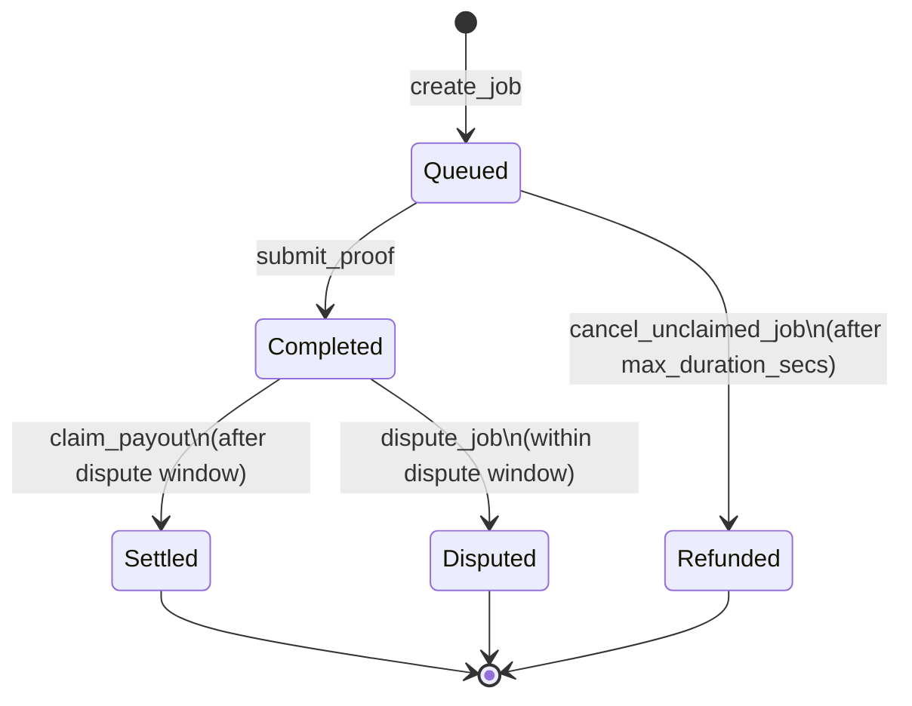

<p align="center">
  
</p>

<p align="center">
  <a href="LICENSE"></a>
  <a href="https://stellar.org/soroban"></a>
  <a href="https://www.typescriptlang.org"></a>
  <a href="https://nodejs.org"></a>
  <a href="../../actions/workflows/ci.yml"></a>
</p>

# PulseRun Client

Developer CLI and runner daemon for [PulseRun](https://pulserun.com), a
pay-per-run compute and CI runner protocol on Stellar. A requester locks a
budget in a Soroban escrow before a job starts; a runner executes the job in an
isolated Docker sandbox, submits a metered execution proof, and the contract
settles for the seconds actually executed while returning the unspent remainder.
No invoices, no trust, no custodians.

This repository is the **application layer** half of PulseRun. The on-chain
escrow and settlement contracts live in
[`pulserun-core`](https://github.com/PulseRun-Labs/pulserun-core); the client is
written against that contract's published ABI.

---

## Contents

- [Why PulseRun](#why-pulserun)
- [Built on Stellar & Soroban](#built-on-stellar--soroban)
- [Maintainers](#maintainers)
- [Architecture](#architecture)
- [Job lifecycle](#job-lifecycle)
- [Commands](#commands)
- [Running a daemon](#running-a-daemon)
- [Configuration](#configuration)
- [The job-spec gap](#the-job-spec-gap)
- [Proof model](#proof-model)
- [Security model](#security-model)
- [Development](#development)
- [Contributing](#contributing)
- [License](#license)

---

## Why PulseRun

Compute and CI work is metered and bursty, but it is almost always paid for
retroactively. That mismatch has a measurable cost:

- **27% of cloud spend is wasted**, mostly on idle or over-provisioned resources
  ([Flexera, _State of the Cloud 2025_](https://www.flexera.com/)).
- **83% of container cost is associated with idle resources**
  ([Datadog](https://www.datadoghq.com/state-of-cloud-costs/)).

Pay-per-run inverts the payment model so a requester never funds idle capacity
and a runner is funded before starting. The escrow enforces the terms on both
sides:

| Property                            | Mechanism                                                                                 |
| ----------------------------------- | ----------------------------------------------------------------------------------------- |
| A runner is always funded           | `create_job` transfers the full `max_budget` into the contract before the job is written. |
| A requester can never be overbilled | A proof is bounded by `max_duration_secs` and payout is hard-capped at `max_budget`.      |
| Either side can escalate            | Payout is frozen for `dispute_window_secs`; `dispute_job` halts it pending resolution.    |

## Built on Stellar & Soroban

Stellar and Soroban are load-bearing here, not decorative:

- **The escrow is a Soroban contract.** The budget is custodied by `PulseEscrow`
  deployed to Soroban. Without an on-chain contract VM that can hold and move
  value under program logic, there is no trustless escrow to build.
- **Settlement in Stellar assets via the Stellar Asset Contract (SAC).** Jobs
  settle in any SEP-41 token, including the SAC of a Stellar-issued asset, so
  requesters pay in the asset they already hold.
- **Metered settlement is viable because settlement is cheap and fast.**
  Per-run settlement only makes sense if settling a single run costs little
  relative to the run.
- **`Address::require_auth` gives the contract proof of who agreed.** The CLI and
  daemon sign as the requester and runner; the contract validates each address
  against the stored job before authorizing.
- **Ledger time drives the protocol.** The dispute window and the unclaimed-job
  timeout are both measured against the ledger timestamp, not an operator clock.

## Maintainers

<table align="center">
  <tr>
    <td align="center">
      <strong>Adesh</strong>
      <br />
      <a href="https://github.com/Adesh-tech09">@Adesh-tech09</a>
      <br />
      <a href="https://t.me/PLACEHOLDER_TELEGRAM">Telegram</a>
    </td>
  </tr>
</table>

<!-- TODO: replace PLACEHOLDER_TELEGRAM with the maintainer's real handle, and
     add teammates as extra <td> cells if there are more maintainers. -->

## Architecture

```text
        create_job (locks max_budget)          submit_proof
┌───────────┐  ───────────────────────►  ┌──────────────┐  ───────────►  ┌────────────┐
│ Requester │                            │ PulseEscrow  │                │   Runner   │
│  (pulserun│  ◄───────────────────────  │ (pulserun-   │  ◄───────────  │ (pulserun- │
│   run)    │            claim_payout    │   core)      │   earnings     │   daemon)  │
└───────────┘                            └──────────────┘                └────────────┘
       │                                        ▲  │                          │
       │ dispute_job / cancel_unclaimed_job     │  ▼                          ▼
       └────────────────────────────────────────┘  ┌───────────────┐   ┌────────────┐
                                                   │ payment_token │   │  sandbox   │
                                                   │ (SEP-41/SAC)  │   └────────────┘
                                                   └───────────────┘
```

The CLI talks only to the contract (`create_job`, `get_job`, `dispute_job`,
`cancel_unclaimed_job`, `claim_payout`). The daemon is the runner: it discovers
its queued jobs by polling the contract, runs each in a sandbox, and calls
`submit_proof` then `claim_payout`.

### Job lifecycle



### Settlement math

```text
duration  = proof.duration_secs                          (validated: 1 ..= max_duration_secs)
earnings  = min(rate_per_second * duration, max_budget)  (runner)
refund    = max_budget - earnings                        (requester)
```

Because `create_job` escrows the whole `max_budget`, settlement is fully
self-contained. Full mechanics:
[`docs/protocol-mechanics.md`](docs/protocol-mechanics.md).

## Repository layout

```text
pulserun-client/
├── packages/
│   ├── cli/             # @pulserun/cli — `pulserun`
│   │   └── src/
│   │       ├── index.ts          # commander entrypoint
│   │       ├── config.ts         # flags + env resolution
│   │       ├── ui.ts             # colour, tables, formatting
│   │       ├── client/soroban.ts # typed PulseEscrow client
│   │       └── commands/         # run, status, claim, dispute, cancel
│   └── daemon/          # @pulserun/daemon — `pulserun-daemon`
│       └── src/
│           ├── index.ts          # poll → execute → prove → claim
│           ├── watcher.ts        # discovery by polling get_job
│           ├── contract.ts       # runner-side ABI access
│           ├── executor.ts       # Docker sandboxing + limits
│           ├── proof.ts          # hashing + metered proof
│           ├── specs.ts          # job-spec store
│           └── config.ts         # env config + logging
├── docs/                # documentation site
├── scripts/             # issue generation + repo setup
└── .github/workflows/   # CI: lint, typecheck, build, test
```

## Commands

Submit a job and watch it until the escrow settles:

```bash
pulserun run \
  --runner "$RUNNER_ADDRESS" \
  --token "$MOCKTOKEN_ID" \
  --max-budget 1.5 \
  --rate 0.001 \
  --max-duration 900 \
  --key "$PULSERUN_SECRET_KEY" \
  --contract "$PULSEESCROW_ID" \
  --network testnet
```

`run` exits `0` when the job settles and `1` when it is refunded or disputed, so
it drops straight into a CI pipeline. Add `--no-wait` to return as soon as the
escrow is locked, or `--json` for machine-readable output.

Inspect a job at any time — no signing key required, the read is a simulation:

```bash
pulserun status 42 --contract "$PULSEESCROW_ID"
```

```text
Job #42
  Status        Settled
  Requester     GABCDE…WXYZ12
  Runner        GHIJKL…3456NO
  Payment token CCCNLW…HHVF6
  Max budget    1.5 (base units)
  Rate / second 0.001
  Max duration  15m 00s
  Created       2026-01-04T09:12:00.000Z
  Completed     2026-01-04T09:27:30.000Z
  Output hash   0x9f2c…7ab4
  Proof duration 902s
  Exit code     0
```

Lifecycle commands map to the contract's entrypoints:

| Command                 | Contract call          | Who signs |
| ----------------------- | ---------------------- | --------- |
| `pulserun run`          | `create_job`           | requester |
| `pulserun claim <id>`   | `claim_payout`         | anyone    |
| `pulserun dispute <id>` | `dispute_job`          | requester |
| `pulserun cancel <id>`  | `cancel_unclaimed_job` | requester |

## Running a daemon

```bash
export PULSEESCROW_ID=C...
export PULSERUN_SECRET_KEY=S...        # the runner's key
export PULSERUN_NETWORK=testnet
export PULSERUN_JOB_SPECS_FILE=./jobs.json
export PULSERUN_CPU_LIMIT=2
export PULSERUN_MEMORY_LIMIT_MB=2048

pulserun-daemon            # runs until SIGINT/SIGTERM
pulserun-daemon --once     # one poll cycle, then exit (cron-friendly)
```

## Configuration

Shared:

| Variable                            | Default        | Purpose                                 |
| ----------------------------------- | -------------- | --------------------------------------- |
| `PULSEESCROW_ID`                    | —              | PulseEscrow contract ID (required)      |
| `PULSERUN_SECRET_KEY`               | —              | Signing key (required for writes)       |
| `PULSERUN_NETWORK`                  | `testnet`      | `testnet`/`futurenet`/`mainnet`/`local` |
| `STELLAR_RPC_URL`                   | network preset | Soroban RPC endpoint override           |
| `STELLAR_NETWORK_PASSPHRASE`        | network preset | Network passphrase override             |
| `MOCKTOKEN_ID` / `PAYMENT_TOKEN_ID` | —              | Default payment token                   |

Daemon:

| Variable                       | Default                       | Purpose                                |
| ------------------------------ | ----------------------------- | -------------------------------------- |
| `PULSERUN_JOB_SPECS_FILE`      | `./pulserun-jobs.json`        | Job id → `{ image, command }` map      |
| `PULSERUN_POLL_INTERVAL_MS`    | `5000`                        | Delay between chain polls              |
| `PULSERUN_DOCKER_HOST`         | `unix:///var/run/docker.sock` | Docker endpoint                        |
| `PULSERUN_CPU_LIMIT`           | `1`                           | Sandbox CPU limit, in cores            |
| `PULSERUN_MEMORY_LIMIT_MB`     | `1024`                        | Sandbox memory limit, in MiB           |
| `PULSERUN_PIDS_LIMIT`          | `256`                         | Max processes inside the sandbox       |
| `PULSERUN_ALLOW_NETWORK`       | `false`                       | Give sandboxes network access          |
| `PULSERUN_JOB_TIMEOUT_SECONDS` | `900`                         | Hard wall-clock limit per job          |
| `PULSERUN_MAX_CONCURRENCY`     | `1`                           | Jobs executed in parallel              |
| `PULSERUN_AUTO_CLAIM`          | `true`                        | Claim payouts after the dispute window |
| `PULSERUN_LOG_LEVEL`           | `info`                        | `debug`/`info`/`warn`/`error`          |

Every sandbox is created with `MemorySwap` pinned to `Memory`, `PidsLimit` set,
and `NetworkMode: none` unless `PULSERUN_ALLOW_NETWORK` is enabled.

## The job-spec gap

`PulseEscrow.create_job` pins the money and the parties, but not the command
line. Until pulserun-core lands an on-chain metadata hash, the runner reads the
job's image and command from a JSON file keyed by job id:

```json
{ "42": { "image": "node:22-alpine", "command": "pnpm test" } }
```

`pulserun run --image … --cmd … --spec-out ./jobs.json` appends an entry for the
job it just created. A runner on the same host reads that file. Without a spec,
the daemon logs and leaves the job to retry or expire — it never invents a
command. This is an acknowledged interim mechanism, tracked in
[`SUBMISSION.md`](SUBMISSION.md).

## Proof model

A proof is the SHA-256 digest of the sandbox's combined stdout/stderr, plus the
metered wall-clock duration:

```text
output_hash   = SHA256(stdout + stderr)
exit_code     = container exit code (124 when the sandbox timed out)
duration_secs = ceil(wall-clock ms / 1000), floored at 1
```

Because the digest covers the raw logs, a verifier can re-run the same job and
compare hashes without trusting the runner. Timed-out sandboxes are killed and
reported with the conventional exit code `124`.

## Security model

- **Authorization** — every mutating contract call requires the exact party's
  signature; the contract validates the address against the stored job.
- **Secret keys** are read from `--key` / `PULSERUN_SECRET_KEY` and are never
  written to disk or logged.
- **Jobs run offline by default** with CPU, memory and PID ceilings, and are
  always removed, even when log capture fails.
- **A local failure never submits a wrong proof** — if Docker is down or the spec
  is missing, the daemon leaves the job for a retry or to expire.

This code is **unaudited**. See [`SECURITY.md`](SECURITY.md) to report a
vulnerability privately.

## Development

```bash
pnpm install
pnpm lint        # prettier --check . && eslint .
pnpm typecheck   # tsc --noEmit for every package
pnpm test        # vitest for every package
pnpm build       # tsc build into packages/*/dist
```

The test suites never touch the network or Docker: Soroban RPC servers, Docker
runtimes, the job spec store and the escrow client are all injected, so hashing,
resource-limit wiring, timeout handling and contract-call encoding are covered
by fast unit tests.

See [`CONTRIBUTING.md`](CONTRIBUTING.md) and the
[developer guide](docs/developer-guide.md).

## Contributing

Contributions are welcome through pull requests. Every change runs the CI gate
(`lint`, `typecheck`, `build`, `test`). Open work is listed in the
[issue backlog](https://github.com/PulseRun-Labs/pulserun-client/issues).

<a href="https://github.com/PulseRun-Labs/pulserun-client/graphs/contributors">
  
</a>

## License

[MIT](LICENSE) © 2026 PulseRun Labs
