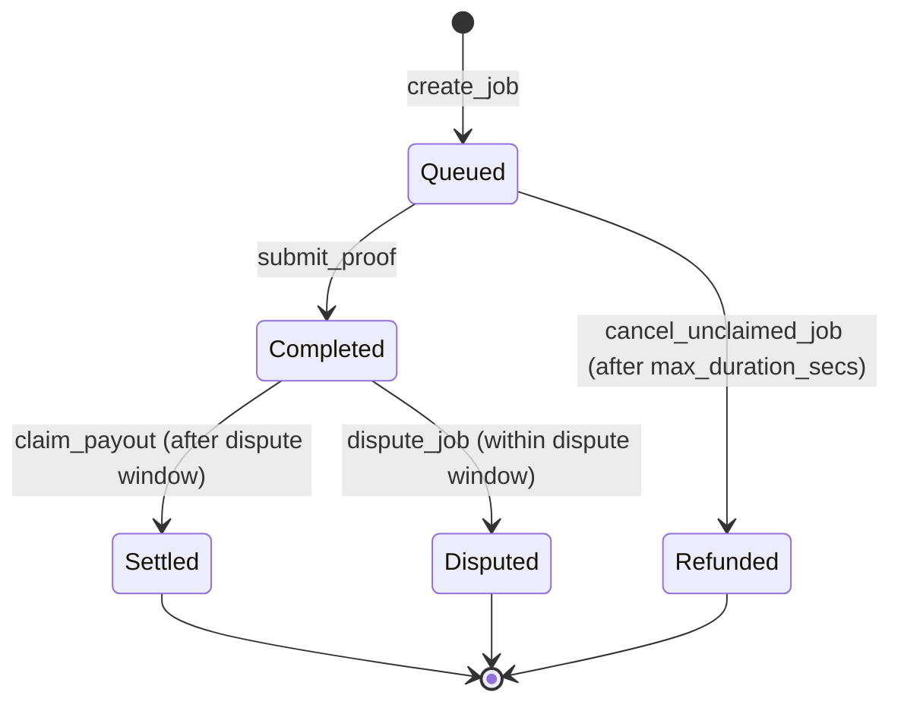

# Protocol mechanics

Every job is an escrow with a single lifecycle. This page is the state machine
and the settlement math the client relies on. The contract itself lives in
[pulserun-core](https://github.com/PulseRun-Labs/pulserun-core).

## Lifecycle



| State       | Meaning                                               | Who moves it on                    |
| ----------- | ----------------------------------------------------- | ---------------------------------- |
| `Queued`    | Collateral is locked; the runner has not proved yet.  | starts here                        |
| `Completed` | A proof landed; the dispute window is open.           | `submit_proof` (runner)            |
| `Disputed`  | The requester challenged the proof; payout is frozen. | `dispute_job` (requester)          |
| `Settled`   | Earnings paid to the runner, dust refunded.           | `claim_payout` (anyone)            |
| `Refunded`  | The job was never proved; requester made whole.       | `cancel_unclaimed_job` (requester) |

`Settled` and `Refunded` are terminal. `Disputed` is not:
`claim_payout` refuses a disputed job, so resolution happens off-chain and any
release is a follow-up contract entrypoint (tracked in pulserun-core).

## Settlement math

Amounts are integer base units of the `payment_token`. No floats are involved.

```text
duration  = proof.duration_secs                          (validated: 1 ..= max_duration_secs)
metered   = rate_per_second * duration
earnings  = min(metered, max_budget)                     (paid to the runner)
refund    = max_budget - earnings                        (returned to the requester)
```

Because `create_job` escrows the entire `max_budget`, settlement only ever moves
money already held by the contract:

```text
earnings + refund == max_budget   (always)
```

### Worked example

A requester opens a job with `max_budget = 15_000_000` base units (1.5 of a
7-decimal token) and `rate_per_second = 1_000`. The runner proves
`duration_secs = 600`.

```text
metered   = 1_000 * 600        = 600_000
earnings  = min(600_000, 15_000_000) = 600_000   → runner
refund    = 15_000_000 - 600_000    = 14_400_000 → requester
```

The runner ran inside its budget, so they are paid for exactly the seconds they
executed and the requester gets the rest back.

### Capping

If the same job had `rate_per_second = 100_000` and `duration_secs = 600`, the
metered total would be `60_000_000`, above the ceiling:

```text
earnings = min(60_000_000, 15_000_000) = 15_000_000   (hard-capped)
refund   = 0
```

The requester can never be billed past `max_budget`, and a proof that claims more
than `max_duration_secs` is rejected outright (`DurationExceedsMax`).

## Timing

Two windows are measured against the ledger timestamp:

- **Dispute window** (`dispute_window_secs`): `claim_payout` is blocked until
  `completed_at + dispute_window_secs`. `dispute_job` is only valid inside it.
- **Unclaimed timeout** (`max_duration_secs`): a still-`Queued` job may be
  cancelled for a full refund once `created_at + max_duration_secs` has passed.

The runner daemon uses `max_duration_secs` to bound a sandbox: the container is
killed at the earlier of the daemon's own ceiling
(`PULSERUN_JOB_TIMEOUT_SECONDS`) and the job's on-chain expiry, and reported with
exit code `124`.

## The job-spec gap

The contract does not store the job's command line yet. Until pulserun-core adds
an on-chain metadata hash, the runner reads the image and command from a local
file keyed by job id
(see [The job-spec gap](../README.md#the-job-spec-gap)). The escrow still
enforces the money; the spec only tells the runner _what to run_.
